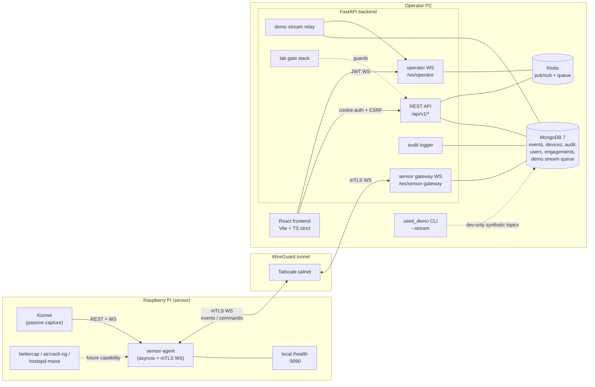
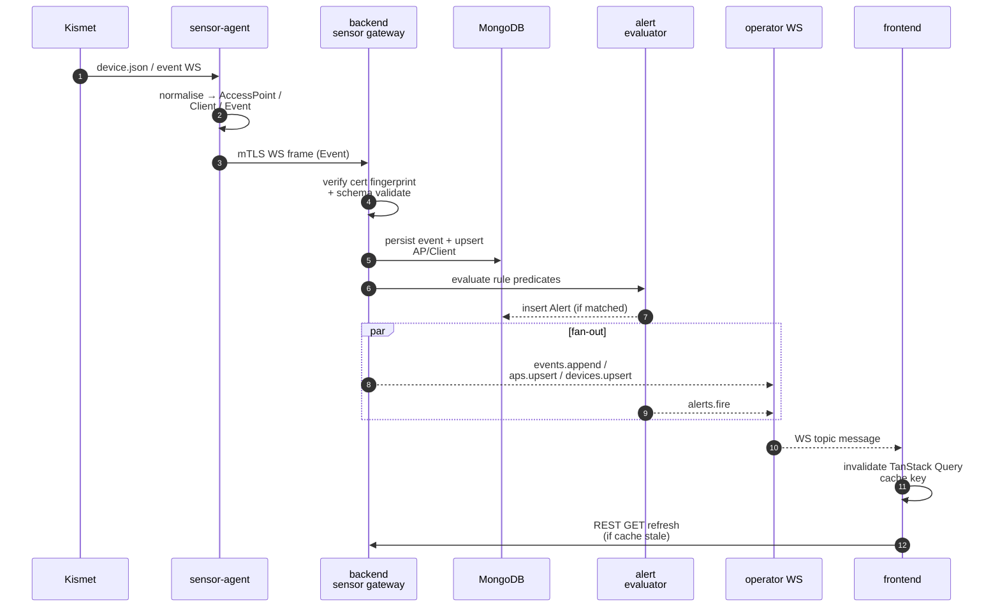
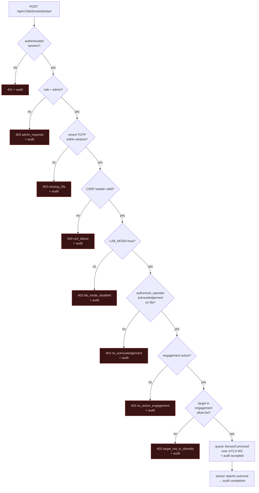
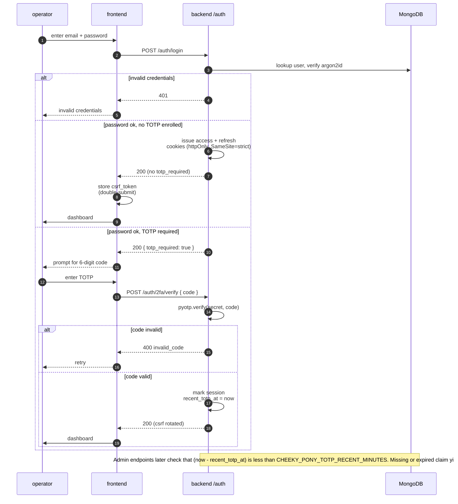

# Architecture

Cheeky Pony is split into three deployable surfaces:

- `sensor-agent`: a Raspberry Pi service that talks to local WiFi tooling, streams
  normalized passive events, exposes local health/capability endpoints, and receives
  backend commands over the authenticated sensor WebSocket.
- `backend`: FastAPI, MongoDB, Redis, in-process development brokers, and worker
  boundaries on the operator PC.
- `frontend`: a React operator console that consumes REST, the operator WebSocket,
  and generated OpenAPI types.

## System topology

The Pi ↔ PC link rides Tailscale's WireGuard tunnel; mTLS termination happens at
the FastAPI sensor-gateway. Sensor identity is bound to the signed client-cert
fingerprint stored on the backend, not just the WebSocket handshake.

## Data Flow

1. Kismet telemetry is normalized by the sensor-agent into shared `Event`,
   `AccessPoint`, and `Client` shapes.
2. The sensor connects to `/ws/sensor-gateway` through the Tailscale/mTLS link. The
   backend verifies the sensor id, signed proxy certificate headers, and stored
   certificate fingerprint before accepting events.
3. The backend persists events and device upserts, evaluates alert rules, and fans
   out operator WebSocket topics such as `events.append`, `aps.upsert`,
   `devices.upsert`, `sensors.update`, `alerts.fire`, `command_result`, and
   `lab.*`.
4. In local development, `seed_demo --stream` writes transient synthetic topic
   records into MongoDB. The backend relay polls that queue and publishes through
   the same operator topic helpers used by real sensor events.
5. The frontend invalidates TanStack Query caches from those WebSocket topics and
   keeps route state shareable through TanStack Router.

## Lab gate stack

Every active-module start request passes through the same default-deny stack.
Any single gate that fails returns `403` with a structured `reason` and writes
an audit entry — accepted starts also audit, so refusal vs. success is
indistinguishable from the audit table's existence alone.

The `/api/v1/lab/status` probe exposes the four user-facing gate inputs
(`lab_mode`, `acknowledgement_on_file`, `is_admin_2fa`, plus implicit
engagement context) so the UI can tell the operator *which* gate is missing
before they trigger a refusal.

## Login + TOTP step-up sequence

The cookie-based auth flow uses two factors: argon2id password verification,
then a TOTP challenge that issues a *recent-verification* claim on a short
window. Admin-only routes require that recent-claim, not just the access cookie.

## Backend Boundaries

The backend owns authentication, CSRF, TOTP step-up, CORS, CSP-adjacent response
headers, active-operation gates, audit logging, persistence, report signing, and
operator/sensor fan-out. FastAPI dependencies provide settings, stores, audit
logging, current user resolution, and brokers so endpoint modules remain small.

MongoDB stores sensors, devices, events, alerts, alert rules, audit logs,
acknowledgements, engagements, allow-lists, and report records. Redis is reserved for
pub/sub and task queue wiring as the deployment moves beyond in-process development
brokers.

## Frontend Boundary

The frontend is built as a Vite/React single-page operator console. Its API contract
comes from `packages/shared-types/schemas/openapi.json`, with generated TypeScript in
`apps/frontend/src/services/api/openapi.d.ts`. It also enforces browser-side safety
at navigation and download boundaries with internal-path and same-origin `/api/...`
URL checks.

The production-style frontend image is a non-root nginx container binding port 8080
inside the container and emitting CSP, `nosniff`, referrer, permissions, frame, COOP,
and CORP headers.

## Active Lab Gates

All active lab functionality is default-deny. A lab start or stop request succeeds
only when the backend validates:

- `CHEEKY_PONY_LAB_MODE=true`
- an `authorized_operator` acknowledgement exists
- the current operator is an admin
- the operator has a recent TOTP verification
- the referenced engagement is active
- the target is present in the engagement allow-list

Every success and refusal writes an audit entry. Sensitive parameter keys are
redacted before audit persistence, and raw tool output is referenced by command id or
artifact hash rather than stored directly in audit records.
