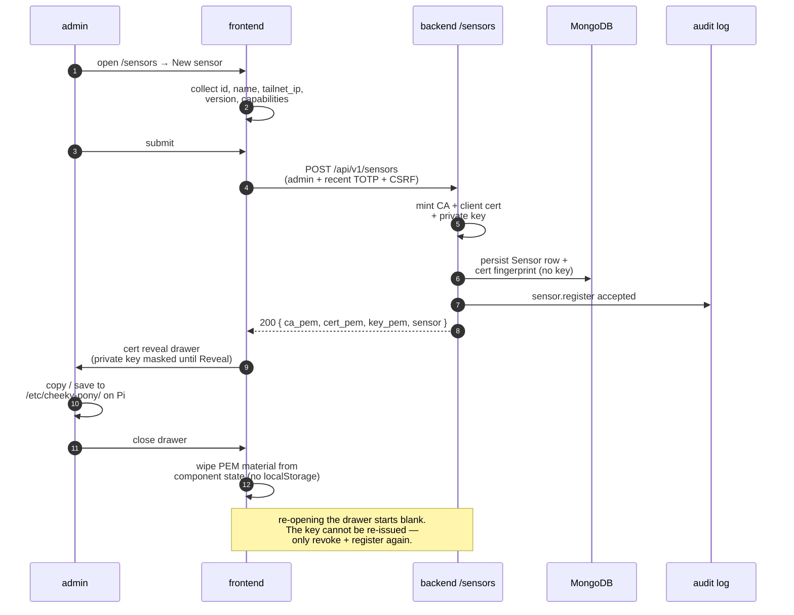

# Operator Guide

## Development

1. Copy `.env.example` to `.env` and replace secrets.
2. Run `make bootstrap`.
3. Run `make up` for Mongo, Redis, backend, and the hardened frontend placeholder.
4. For the real operator UI, run the Vite frontend with
   `pnpm --filter @cheeky-pony/frontend dev` instead of the placeholder container.

Default local URLs:

- frontend: `http://localhost:5173`
- backend: `http://localhost:8000`
- backend health: `http://localhost:8000/health`
- OpenAPI: `http://localhost:8000/openapi.json`

## Demo data

Local development can seed a believable synthetic dataset:

```shell
make seed-demo
```

Remove it with:

```shell
make unseed-demo
```

The seeder writes only visibly fake records: sensor ids use `synth-` prefixes
and AP/client MACs use the locally administered `02:00:` range. Seeded telemetry
records carry `synthetic: true`; normal sensor data does not set that marker.

The seeded dataset includes London-centered AP and sensor coordinates, realistic
urban SSIDs, a small hidden-SSID sample, plausible client vendors, and probe
histories. This lets the map and reconnaissance views render meaningful fixture
data immediately after a fresh seed.

The demo engagement also receives three small sample captures. The seeder stores
them through the same PCAP validation, GridFS metadata, and analyzer services used
by operator uploads, then pre-generates structured findings so reports and future
capture-analysis screens have fixture data.

The command refuses to run unless all safety guards pass:

- `CHEEKY_PONY_ENV=dev`
- `CHEEKY_PONY_LAB_MODE=false`
- no non-synthetic sensor has reported within the last five minutes

Use `python -m cheeky_pony_backend.infra.seed_demo --force` only for deliberate
local recovery. `--clean` removes records where `synthetic == true` plus the
deterministic demo PCAPs and findings, and leaves audit entries intact because
audit logs are append-only.

The frontend can check `GET /api/v1/system/demo-status` after login to show
whether synthetic records are present.

## OUI vendor lookup

Access point and client read APIs enrich MAC addresses with a derived
`vendor_resolved` field when the first three octets match the bundled public OUI
table. The stored `vendor_oui` value remains unchanged in the database; response
serializers present the resolved vendor name when the local table knows it.

Operators and local tooling can also query public OUI data directly:

```shell
curl http://localhost:8000/api/v1/oui/38c986
```

The route is unauthenticated because it returns only public manufacturer-prefix
data, and it is still rate-limited to keep enumeration traffic bounded.

## Derived labels

Access point and client read APIs include local-only `label` and
`label_confidence` fields. Labels are computed from existing SSID, encryption,
vendor, probe-history, and association metadata; they are never persisted and do
not use external lookups or LLM calls.

The default confidence threshold is `0.6`. Set
`CHEEKY_PONY_LABEL_CONFIDENCE_THRESHOLD` between `0.0` and `1.0` to tune how
aggressively weak labels are suppressed to `unknown`.

## AP anomaly cues

Access point read APIs include local-only `anomaly_score` and `anomaly_reasons`
fields. The backend derives them from existing metadata such as encryption,
hidden SSID state, same-SSID vendor mismatches, current associations, and recent
deauthentication events. Scores are response-only and are not persisted.

Authenticated operators can list same-SSID vendor mismatch groups with:

```shell
curl http://localhost:8000/api/v1/access_points/evil-twin-candidates
```

The route is read-only, authenticated, and audited so unusual review activity is
visible without requiring admin privileges.

## AI-assisted insights

AI-assisted insights are disabled by default. Set
`CHEEKY_PONY_LLM_ENABLED=true` and configure an OpenAI-compatible endpoint with
`CHEEKY_PONY_LLM_API_BASE_URL`, `CHEEKY_PONY_LLM_MODEL`, and
`CHEEKY_PONY_LLM_API_KEY`. HTTP local endpoints can omit the key; HTTPS
endpoints require one at startup.

Alert context is available at:

```shell
curl http://localhost:8000/api/v1/insights/alert/<alert-id>
```

Engagement summaries are available at:

```shell
curl http://localhost:8000/api/v1/insights/engagement/<engagement-id>
```

The engagement summary uses engagement metadata, event counts, top alert
severity buckets, and completed PCAP finding counts. Ending an engagement queues
summary generation once, and the read endpoint generates on demand if no cached
summary exists. The route is read-only and requires an authenticated operator
session.

AP descriptions are available on demand at:

```shell
curl http://localhost:8000/api/v1/insights/ap/<bssid>
```

The AP description uses the AP's SSID, channel, band, encryption, local label,
anomaly score, signal summary, and aggregate associated-client mix. It excludes
raw BSSIDs, client MACs, probe histories, and raw packet evidence from the
prompt context. Results cache for 24 hours because AP metadata is comparatively
stable.

PCAP finding explanations are available on demand at:

```shell
curl http://localhost:8000/api/v1/insights/pcap-finding/<finding-id>
```

The PCAP finding explanation uses the structured finding severity, summary,
safe evidence, and related engagement scope size. It never sends raw `tshark`
output, raw EAPOL bytes, or PMKID material to the model, even when LAB_MODE
allows those fields in the PCAP findings API. Results cache indefinitely because
analysis findings are immutable.

The backend does not expose a free-form prompt endpoint. Each insight kind uses
a versioned prompt template in the repository, a Pydantic response schema, and a
cache key that includes the template version and redacted prompt hash.

Privacy controls apply before every dispatch. MAC and BSSID values become
prompt-scoped opaque tokens, sensitive fields are dropped, and audit entries
store only prompt/response hashes, token counts, latency, model, and cost.
Enable `CHEEKY_PONY_LLM_REDACT_SSID=true` or
`CHEEKY_PONY_LLM_REDACT_VENDOR=true` for deployments that do not want SSID or
vendor names sent to the configured model.

Set `CHEEKY_PONY_LLM_BUDGET_USD_MONTHLY` to cap monthly spend. The default `0`
means unlimited and is intended for local/private models where per-call billing
does not apply. `CHEEKY_PONY_LLM_ENABLED=false` is the kill switch and returns
`llm_unavailable` without dispatching.

## First admin

Set `CHEEKY_PONY_BOOTSTRAP_TOKEN` to a random value for first deploy. The first
`POST /api/v1/auth/register` call must include it as
`Authorization: Bearer <bootstrap-token>`. If the token is unset, first-admin
registration returns `503 bootstrap_disabled`.

After the first admin lands, the bootstrap path closes regardless of whether the
environment variable is still present. Rotate or remove the token after the first
admin is created. Subsequent registration requires an authenticated admin with a
verified TOTP session.

Admin actions require both the `admin` role and a recent TOTP verification. The
recent-verification window is controlled by `CHEEKY_PONY_TOTP_RECENT_MINUTES`.

## User management

The `/settings/users` surface is backed by `GET /api/v1/users` and
`PATCH /api/v1/users/{id}`. Both endpoints require an admin with recent TOTP; the
patch route also requires CSRF because it mutates role and TOTP state.

User list responses expose only `UserPublic` fields: id, email, roles, and TOTP
enabled state. Password hashes, TOTP secrets, and refresh-token versions must never
leave the backend.

Admins can replace a user's roles with the allowed role set (`operator`, `admin`) and
can reset TOTP enrollment. Resetting TOTP clears the stored secret and forces the
target user to re-enrol. The backend refuses to remove the final active admin role,
returning `409` and writing a denied audit entry.

## Authorized operator acknowledgement

Admin users must verify TOTP and submit the exact typed legal statement before active modules can be started.

Required statement:

`I am authorized to test the listed wireless targets in this engagement.`

## Sensors

Sensors register through the backend, receive a client certificate, and connect to
`/ws/sensor-gateway` over the Tailscale/mTLS path. The backend binds the WebSocket
sensor id to the signed client-certificate headers and the stored certificate
fingerprint.

### Registering a new Pi

1. On `/sensors`, click **New sensor** (or hit `/sensors?new=1`).
2. Fill in the form: stable id, display name, tailnet IP, agent version, and
   tick only the capabilities the Pi actually advertises.
3. Submit. The backend mints a fresh CA + client certificate + private key and
   returns them **once**. The drawer surfaces all three blocks; the private key
   stays masked until you click **Reveal**.
4. Copy each block (or use the copy button) to `/etc/cheeky-pony/` on the Pi.
   The PEM material lives only in component state — closing the drawer wipes
   it, and there is no API to re-fetch the private key. If you dismiss before
   saving, the only path forward is to revoke and re-register.



### Revoking a sensor

In the sensor detail drawer, click **Revoke certificate…**, type the sensor id
verbatim into the confirm input, and submit. The backend tears down the cert
binding; the agent loses gateway access on its next reconnect. Already-revoked
sensors render an inert chip instead of the revoke form, so the action is
non-idempotent by design.

### Lifecycle commands

Sensor lifecycle commands are available to admins with recent TOTP:

- `POST /api/v1/sensors/{id}/commands/restart`
- `POST /api/v1/sensors/{id}/commands/update`
- `POST /api/v1/sensors/{id}/commands/set-channel`

Command results are broadcast to operators as `command_result` WebSocket messages
and written to audit.

## Lab command plane

Active module starts are default-deny. Before using `/api/v1/lab/{module}/start`, enable `LAB_MODE=true`, create the authorized-operator acknowledgement, create an active engagement, and add each target to that engagement allow-list.

Operators can inspect the current gate inputs at `/api/v1/lab/status`. The
response includes the original summary fields plus a readiness checklist with
fix hints for lab mode, admin role, recent TOTP, active engagement,
authorized-operator acknowledgement, and allow-list state. Engagement allow-lists
can be read with `GET /api/v1/engagements/{id}/allow-list` and updated with the
same `{kind, value}` target shape used by lab module starts.

The backend currently delivers guarded module start and stop commands to the sensor-agent over the mTLS WebSocket and records all success and refusal outcomes in audit logs. Sensor-agent module execution remains capability-gated and does not run offensive tooling unless the Pi-side implementation for that module is added later.

Supported lab modules share the same request shape:

- `rogue-ap`
- `deauth`
- `evil-twin`
- `captive-portal`
- `mitm`

Lab WebSocket topics use `lab.started`, `lab.progress`, and `lab.stopped`. Refusals
return `403` with a structured `reason` so the UI can explain which gate is missing.

## Alerts

Authenticated operators can list and acknowledge alerts. Alert rule creation,
updates, and deletion require admin plus recent TOTP and write audit entries. Rule
predicates are intentionally simple JSON for v1 and are evaluated against normalized
event payloads.

## Engagement reports

Authenticated operators can request engagement exports from `/api/v1/engagements/{id}/reports` in `jsonl`, `html`, `pdf`, or `pcap` format. The status endpoint returns `pending`, `ready`, or `failed`; ready reports include a short-lived signed download URL.

Reports generate bounded summary artifacts from stored events, alerts, audit
entries, and completed capture findings. The capture section includes curated
finding summaries such as deauthentication bursts, probe-response anomalies, and
DHCP hostnames. It never includes raw `tshark` output or raw packet bytes. PCAP
exports still produce an empty capture container until a dedicated packet export
workflow is designed.

The frontend accepts only same-origin `/api/...` report download URLs. If a backend
or proxy ever returns an unsafe URL, the operator UI blocks the anchor instead of
navigating.

## Uploading captures for analysis

Admins with recent TOTP verification can upload `.pcap` and `.pcapng` captures to
an active engagement at `/api/v1/engagements/{id}/pcaps`. Uploads are capped by
`CHEEKY_PONY_PCAP_MAX_UPLOAD_MB` (default `100`), validated by magic bytes, stored
in GridFS, and audited with the sanitized filename, size, capture hash, and
engagement id.

Authenticated operators can list and read capture metadata for engagements they
can access. There is no raw capture download route in this phase. Deleting a
capture requires admin plus recent TOTP, CSRF, and typing the sanitized filename
back in the request body.

## Analyzing captures

Admins with recent TOTP verification can start analysis for an uploaded capture
with `POST /api/v1/engagements/{id}/pcaps/{pcap_id}/analyze`. The backend queues
the run, marks the capture as `analyzing`, and returns an `analysis_id`. Only one
analysis can run for a given capture at a time; a second request receives `409`.

The worker runs the local `tshark` binary against code-reviewed filters only. No
operator-supplied tshark expressions are accepted. The first analysis slice
extracts protocol hierarchy, top conversations, and deauthentication-burst
findings. Operators can poll `/analysis` for status and read structured findings
from `/findings`; raw tshark stdout and stderr are never exposed or persisted as
operator-facing data.

WiFi-specific analysis also extracts EAPOL handshake metadata, beacon summaries,
and probe-response anomalies. EAPOL findings show BSSID, client MAC, observed
message count, and completion state in all environments. PMKID values and raw
EAPOL key data are only returned while `CHEEKY_PONY_LAB_MODE=true`; when lab mode
is off, those fields are omitted from finding responses.

Network-layer analysis summarizes DNS queries, TLS ClientHello SNI names, and
DHCP client metadata. Hostnames ending in
`CHEEKY_PONY_PCAP_INTERNAL_HOSTNAME_SUFFIXES` (default `.local,.internal,.corp`)
are stored as `INTERNAL_HOSTNAME_REDACTED` so internal names do not leak into
screenshots or reports. DHCP findings enrich MACs from existing Client records
first, then the bundled OUI table; the backend performs no external lookups.

Completed analyses are also available to engagement reports. The report worker
summarizes only structured, bounded finding fields and shows "Analysis pending or
unavailable" when a capture exists but no successful findings have been produced.

Backend startup requires `tshark >= CHEEKY_PONY_TSHARK_MIN_VERSION` (default
`4.2.0`) unless the app runs in the test environment. The Docker image and CI
install tshark automatically. Local non-Docker development needs tshark on `PATH`
or `CHEEKY_PONY_TSHARK_PATH` pointing at the binary.

Screenshot placeholder: Phase 5 frontend will add the upload, capture metadata,
analysis status, and findings screens against these backend endpoints.
