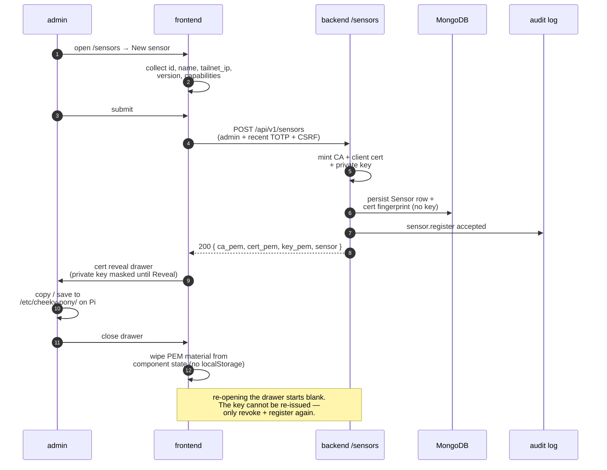

# Operator Guide

## Development

1. Copy `.env.example` to `.env` and replace secrets.
2. Run `make bootstrap`.
3. Run `make up` for Mongo, Redis, backend, and the hardened frontend placeholder.
4. For the real operator UI, run the Vite frontend with
   `pnpm --filter @cheeky-pony/frontend dev` instead of the placeholder container.

Default local URLs:

- frontend: `http://localhost:5173`
- backend: `http://localhost:8000`
- backend health: `http://localhost:8000/health`
- OpenAPI: `http://localhost:8000/openapi.json`

## First admin

The first user may self-register. After that, registration requires an authenticated admin with a verified TOTP session.

Admin actions require both the `admin` role and a recent TOTP verification. The
recent-verification window is controlled by `CHEEKY_PONY_TOTP_RECENT_MINUTES`.

## User management

The `/settings/users` surface is backed by `GET /api/v1/users` and
`PATCH /api/v1/users/{id}`. Both endpoints require an admin with recent TOTP; the
patch route also requires CSRF because it mutates role and TOTP state.

User list responses expose only `UserPublic` fields: id, email, roles, and TOTP
enabled state. Password hashes, TOTP secrets, and refresh-token versions must never
leave the backend.

Admins can replace a user's roles with the allowed role set (`operator`, `admin`) and
can reset TOTP enrollment. Resetting TOTP clears the stored secret and forces the
target user to re-enrol. The backend refuses to remove the final active admin role,
returning `409` and writing a denied audit entry.

## Authorized operator acknowledgement

Admin users must verify TOTP and submit the exact typed legal statement before active modules can be started.

Required statement:

`I am authorized to test the listed wireless targets in this engagement.`

## Sensors

Sensors register through the backend, receive a client certificate, and connect to
`/ws/sensor-gateway` over the Tailscale/mTLS path. The backend binds the WebSocket
sensor id to the signed client-certificate headers and the stored certificate
fingerprint.

### Registering a new Pi

1. On `/sensors`, click **New sensor** (or hit `/sensors?new=1`).
2. Fill in the form: stable id, display name, tailnet IP, agent version, and
   tick only the capabilities the Pi actually advertises.
3. Submit. The backend mints a fresh CA + client certificate + private key and
   returns them **once**. The drawer surfaces all three blocks; the private key
   stays masked until you click **Reveal**.
4. Copy each block (or use the copy button) to `/etc/cheeky-pony/` on the Pi.
   The PEM material lives only in component state — closing the drawer wipes
   it, and there is no API to re-fetch the private key. If you dismiss before
   saving, the only path forward is to revoke and re-register.

### Revoking a sensor

In the sensor detail drawer, click **Revoke certificate…**, type the sensor id
verbatim into the confirm input, and submit. The backend tears down the cert
binding; the agent loses gateway access on its next reconnect. Already-revoked
sensors render an inert chip instead of the revoke form, so the action is
non-idempotent by design.

### Lifecycle commands

Sensor lifecycle commands are available to admins with recent TOTP:

- `POST /api/v1/sensors/{id}/commands/restart`
- `POST /api/v1/sensors/{id}/commands/update`
- `POST /api/v1/sensors/{id}/commands/set-channel`

Command results are broadcast to operators as `command_result` WebSocket messages
and written to audit.

## Lab command plane

Active module starts are default-deny. Before using `/api/v1/lab/{module}/start`, enable `LAB_MODE=true`, create the authorized-operator acknowledgement, create an active engagement, and add each target to that engagement allow-list.

Operators can inspect the current gate inputs at `/api/v1/lab/status`. Engagement allow-lists can be read with `GET /api/v1/engagements/{id}/allow-list` and updated with the same `{kind, value}` target shape used by lab module starts.

The backend currently delivers guarded module start and stop commands to the sensor-agent over the mTLS WebSocket and records all success and refusal outcomes in audit logs. Sensor-agent module execution remains capability-gated and does not run offensive tooling unless the Pi-side implementation for that module is added later.

Supported lab modules share the same request shape:

- `rogue-ap`
- `deauth`
- `evil-twin`
- `captive-portal`
- `mitm`

Lab WebSocket topics use `lab.started`, `lab.progress`, and `lab.stopped`. Refusals
return `403` with a structured `reason` so the UI can explain which gate is missing.

## Alerts

Authenticated operators can list and acknowledge alerts. Alert rule creation,
updates, and deletion require admin plus recent TOTP and write audit entries. Rule
predicates are intentionally simple JSON for v1 and are evaluated against normalized
event payloads.

## Engagement reports

Authenticated operators can request engagement exports from `/api/v1/engagements/{id}/reports` in `jsonl`, `html`, `pdf`, or `pcap` format. The status endpoint returns `pending`, `ready`, or `failed`; ready reports include a short-lived signed download URL.

The first implementation generates bounded summary artifacts from stored events, alerts, and audit entries. PCAP exports currently produce an empty capture container until packet capture storage lands.

The frontend accepts only same-origin `/api/...` report download URLs. If a backend
or proxy ever returns an unsafe URL, the operator UI blocks the anchor instead of
navigating.
